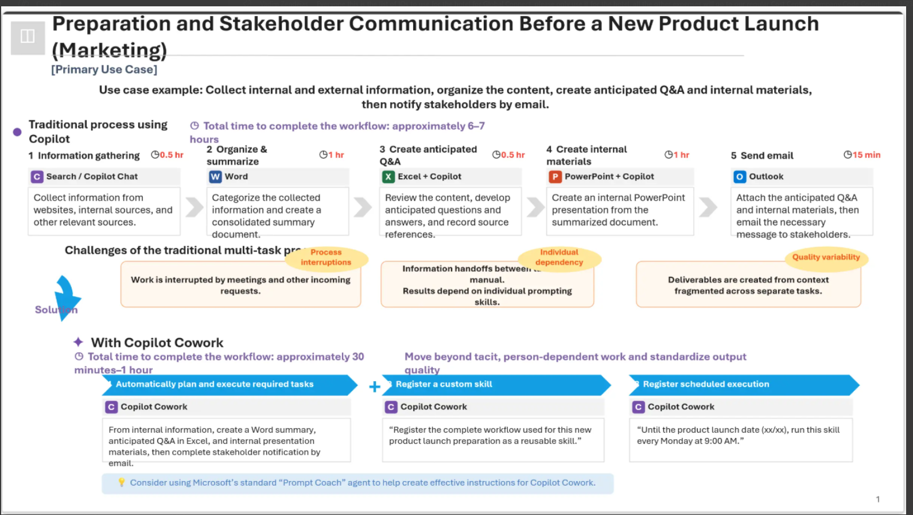
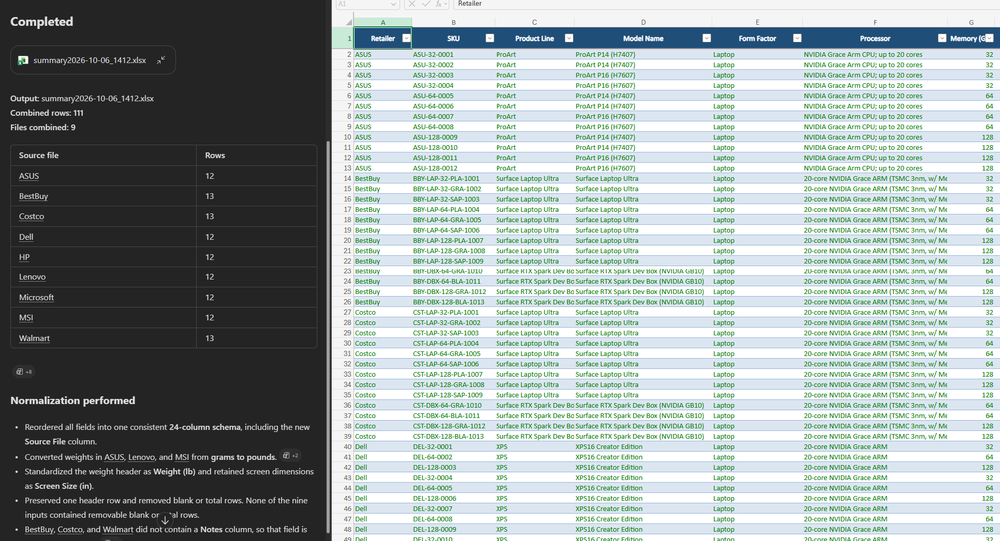
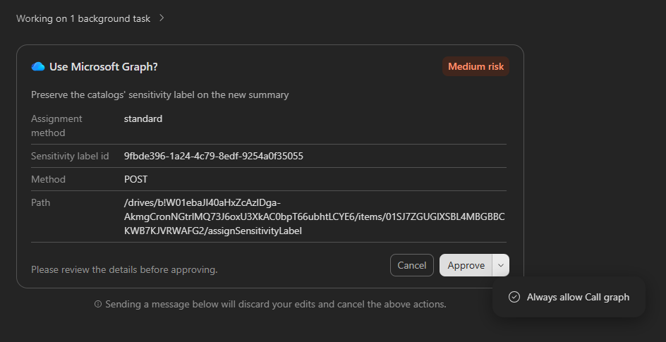
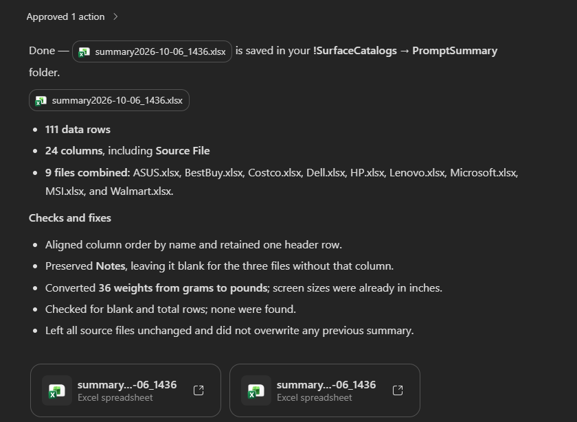
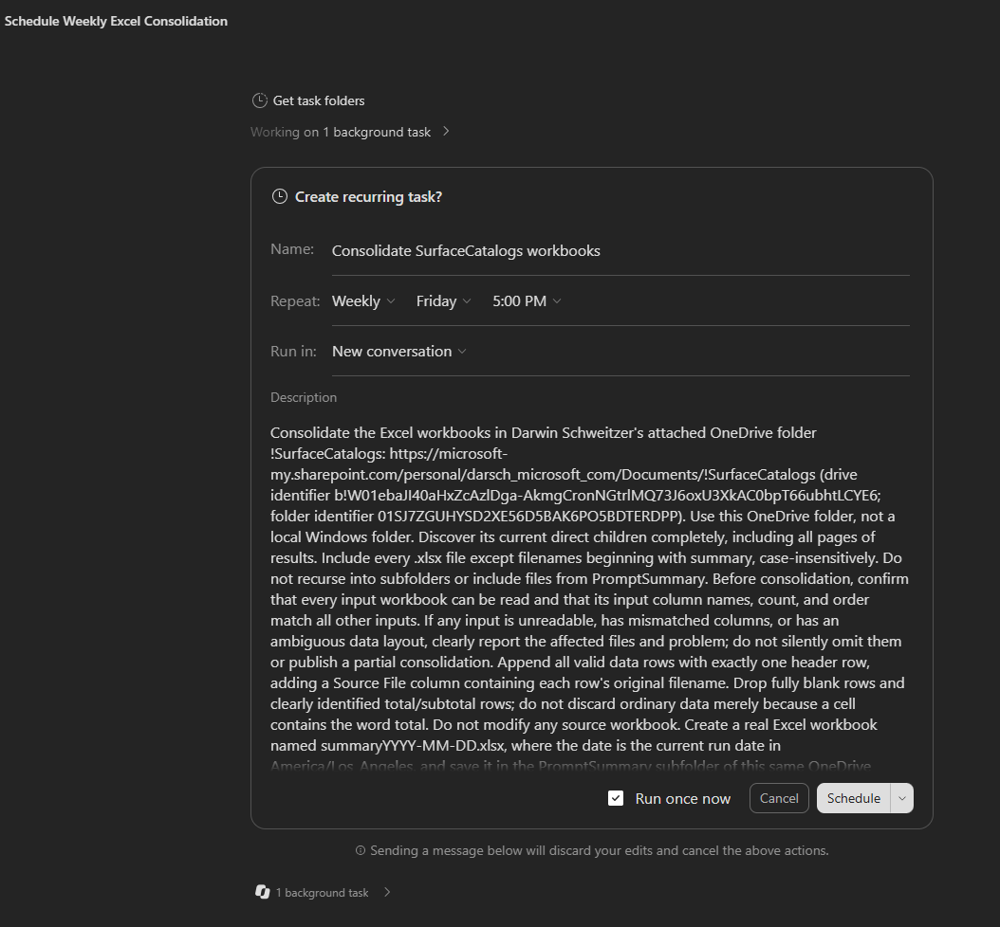
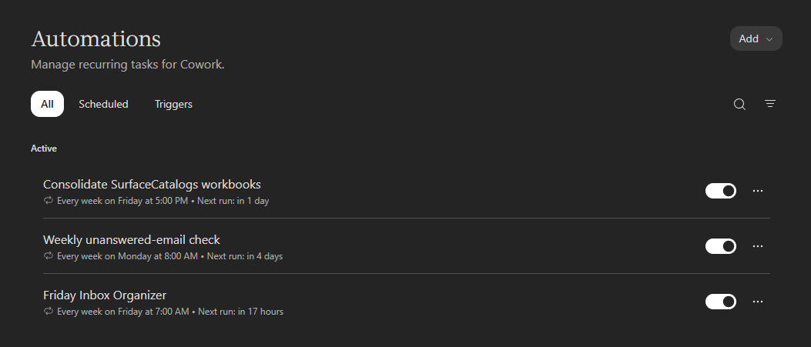
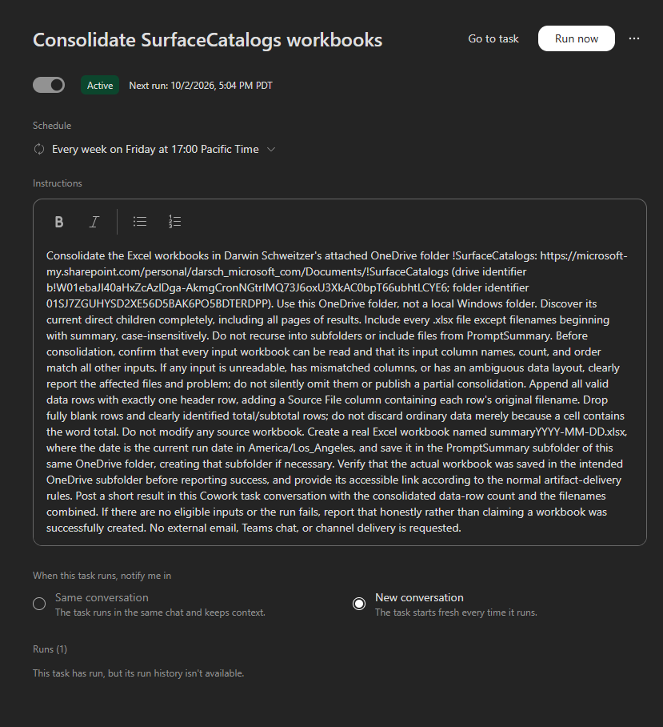
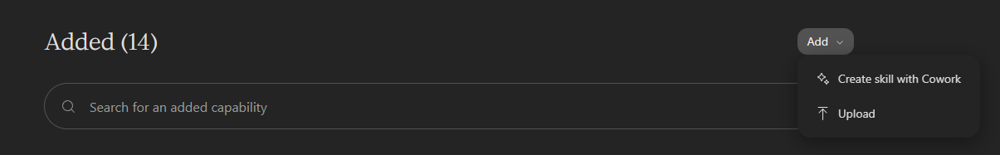
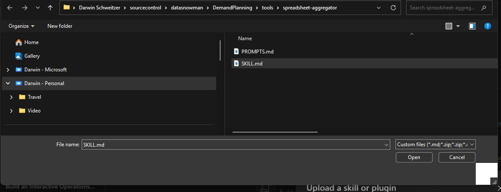
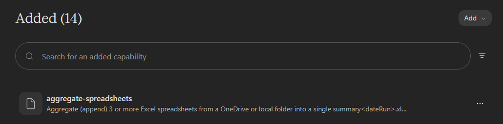

# Demand Planning — Ingesting & Aggregating Data (E2E Demo)

A step-by-step demo that ingests retailer catalog spreadsheets for the **Surface Laptop
Ultra** and **Surface RTX Spark Dev Box**, then aggregates them into one summary workbook.

**The demo has three parts:**

| Part | Tool | What you do |
|------|------|-------------|
| 1 | **Copilot Chat** | Aggregate the 3 local `.xlsx` files in this repo |
| 2 | **Cowork** | Aggregate the spreadsheets sitting in a OneDrive folder (optionally on a Friday schedule) |
| 3 | **Copilot Code** | Build a real, version-controlled read-only app over the summary spreadsheet |

> The nine catalogs (`xlsx spreadseets') are **synthetic** demo
> data in the `spreadsheets\` folder. Product specs and source links are in
> [Reference: product specs](#reference-product-specs) at the bottom.

---

## The concept this repo illustrates



The slide above (a marketing "new product launch" example) captures the shift this repo is
built to demonstrate: moving a **traditional, multi-tool, person-dependent process** into a
**standardized, automated, scheduled Cowork workflow**.

**How this repo maps to the slide:**

| Slide concept | Where this repo shows it |
|---------------|--------------------------|
| **Traditional process using Copilot** — separate tools (Chat, Word, Excel, Outlook), ~6–7 hrs, interrupted and manual | **Part 1 — Copilot Chat**: a human drives the aggregation one file at a time, by hand, in a single tool. |
| **Challenge: individual dependency** — "results depend on individual prompting skills" | The bundled **script + skill** encode the logic (clean → append → `Source File` → formatted output), so the result no longer depends on who prompts it. |
| **Challenge: quality variability** — "deliverables created from fragmented context" | Every run produces the **same** `summary<dateRun>.xlsx`: identical columns, no stray total rows, consistent formatting. |
| **With Cowork #1 — Automatically plan and execute required tasks** | **Part 2, Step 3**: one Cowork prompt reads the OneDrive folder and produces the summary end-to-end. |
| **With Cowork #2 — Register a custom skill** ("register the workflow as a reusable skill") | **Part 2, Step 2**: `tools\spreadsheet-aggregator\SKILL.md` is exactly that reusable, registerable custom skill (`aggregate-spreadsheets`). |
| **With Cowork #3 — Register scheduled execution** ("run this skill every Monday at 9:00 AM") | **Part 2, Step 4**: the "every Friday at 5pm" scheduled Cowork task — the same idea on a different cadence. |
| **Tip: use "Prompt Coach" to craft instructions** | The ready-made prompts in this README and `PROMPTS.md` play that role — vetted instructions you can paste directly. |

**Where the analogy is partial:** the slide's example spans multiple Office apps (Word
summary, PowerPoint deck, Outlook email) for a marketing launch, while this repo focuses on
the **data-ingestion slice** — aggregating spreadsheets into one workbook — for demand
planning. The *pattern* is identical (manual multi-step work → custom skill → scheduled
automation); only the specific deliverables differ. **Part 3** (a real, version-controlled app
over the summary, built with **Copilot Code**) extends the pattern one step further than the
slide — turning the consolidated data into a durable, shareable viewer.

---

## Part 1 — Copilot Chat: aggregate the 3 files

**Goal:** append the three catalogs into one `summary<dateRun>.xlsx`.

How you give Copilot the files depends on which chat surface you're in:

### Option A — Attach the files (M365 / web / Teams Copilot Chat)

These surfaces have **no local filesystem**, so you can't reference a folder path — attach the
files directly (uploading sends a copy to OneDrive, which is expected).

**Step 1.** Click **+** / the attach button and upload `BestBuy.xlsx`, `Walmart.xlsx`, and
`Costco.xlsx`.

**Step 2.** Paste this prompt (note: "the three attached spreadsheets", not a folder):

> ⚠️ **Point Cowork at Attach cloud files first.** Select/attach your **`SurfaceCatalogs`**
> folder (the folder chip) so Cowork knows where to look. If you skip this, the prompt has no
> folder to scan. *(Easy to forget on the first run!)*

```
Append the nine attached spreadsheets into a single summary<dateRun>.xlsx, where <dateRun> is the current date and time (for example 2026-10-01_1408) so running it more than once a day won't overwrite the previous file. Keep one header row, add a "Source File" column so I can tell which retailer each row came from, and drop any blank or total rows. Confirm the columns match across all three files first, then show me the row count and which files were combined.  Fix any column order discrepencies, as well as converting any units (like grams, oz, pounds to one unit of measure) with a preference for pounds related to weight and inches related to things like screen size.
```

### Option B — Reference the folder (GitHub Copilot in VS Code / Copilot CLI)

These surfaces **can** see your workspace, so you can point at the folder instead of attaching.

**Step 1.** Open this repo in VS Code (with Copilot) or the Copilot CLI.

**Step 2.** Paste this prompt:

```
Append the nine attached spreadsheets into a single summary<dateRun>.xlsx, where <dateRun> is the current date and time (for example 2026-10-01_1408) so running it more than once a day won't overwrite the previous file. Keep one header row, add a "Source File" column so I can tell which retailer each row came from, and drop any blank or total rows. Confirm the columns match across all three files first, then show me the row count and which files were combined.  Fix any column order discrepencies, as well as converting any units (like grams, oz, pounds to one unit of measure) with a preference for pounds related to weight and inches related to things like screen size.
```

**Step 3.** Copilot creates `summary<dateRun>.xlsx` (e.g. `summary2026-10-01_1408.xlsx`) — in
the folder for Option B, or as a downloadable file for Option A.

**Expected result:** 111 rows, 24 columns (the 23 catalog columns + `Source
File`), no total rows. ✅

Example output from running the Option A prompt in M365 Copilot Chat — Copilot confirms the
23-column match, reports 111 combined rows, and saves `summary2026-10-01.xlsx`
(this run predates the time-suffix convention; the current prompt names files like
`summary2026-10-01_1408.xlsx`):



> **Under the hood (optional):** this is exactly what the bundled script does. In a workspace
> you can run it directly instead of asking Chat:
> ```
> python tools/spreadsheet-aggregator/aggregate_spreadsheets.py --input spreadsheets
> ```

---

## Part 2 — Cowork: aggregate spreadsheets from a OneDrive folder

Same outcome as Part 1, but the source files live in a **OneDrive folder** and the work runs
in **Cowork** — optionally on a recurring **Friday** schedule.

### Step 1 — Put the spreadsheets in OneDrive

Pick (or create) a OneDrive folder and copy the catalogs into it, e.g.:

```
C:\Users\<you>\OneDrive - Microsoft\SurfaceCatalogs\
    BestBuy.xlsx
    Walmart.xlsx
    Costco.xlsx
    etc
```

You can drop in **3 or more** files — any `.xlsx` with the same columns will be included.
On Windows a synced OneDrive folder is just a normal local path, so Cowork reads it directly.

### Step 2 — Run it (one-off, no custom skill needed)

You don't need to register anything first — just describe the whole task in one Cowork prompt.
Paste this and **replace the folder path with your OneDrive folder**:

> ⚠️ **Point Cowork at the OneDrive folder first.** Select/attach your **`SurfaceCatalogs`**
> folder (the folder chip) so Cowork knows where to look. If you skip this, the prompt has no
> folder to scan. *(Easy to forget on the first run!)*

```
In my OneDrive folder "C:\Users\<you>\OneDrive - Microsoft\SurfaceCatalogs", find every .xlsx
file (skip any file whose name starts with "summary", and ignore the output subfolder). Append
the attached spreadsheets into a single summary<dateRun>.xlsx, where <dateRun> is the 
current date and time (for example 2026-10-01_1408) so running it more than once a day won't 
overwrite the previous file. Keep one header row, add a "Source File" column so I can tell which
retailer each row came from, and drop any blank or total rows. Confirm the columns match across 
all three files first, then show me the row count and which files were combined.  Fix any column
order discrepencies, as well as converting any units (like grams, oz, pounds to one unit of measure)
with a preference for pounds related to weight and inches related to things like screen size. Save
it inside a "PromptSummary" subfolder of that OneDrive folder (create the PromptSummary folder
if it doesn't exist). Do not modify the source files. When done, tell me the row count, the column
count, and which files were combined.
```


Note that you might need to approve more than one thing

### Step 3 — Check the result

**Expected result:** `summary<dateRun>.xlsx` (e.g. `summary2026-10-01_1408.xlsx`) appears in a
**`PromptSummary`** subfolder of your OneDrive folder, with one row per SKU across all source
files and a `Source File` column — 111 rows / 24 columns for the three sample catalogs, no total
rows. ✅

Example output from running the Step 2 no-skill prompt in Cowork — it combines the three
OneDrive workbooks into `summary2026-10-01.xlsx` (111 data rows, 23 columns, `Source File`
first, one header row, no blank/total rows; this run predates the time-suffix convention):



### Step 4 (optional) — Schedule it for every Friday

> ⚠️ **Before you run the schedule prompt, point Cowork at the OneDrive folder.** Select/attach
> your **`SurfaceCatalogs`** folder (the folder chip, as shown above) so the scheduled task knows
> where to look each week. If you skip this, the recurring task has no folder to scan. *(Easy to
> forget on the first run!)*

To make the same no-skill task recur, paste this in Cowork:

```
Set up a recurring Cowork task every Friday at 5pm. Each run should look in my OneDrive folder
"C:\Users\<you>\OneDrive - Microsoft\SurfaceCatalogs", find every .xlsx (skipping any file
whose name starts with "summary"), and ignore the output subfolder). Append
the attached spreadsheets into a single summary<dateRun>.xlsx, where <dateRun> is the 
current date and time (for example 2026-10-01_1408) so running it more than once a day won't 
overwrite the previous file. Keep one header row, add a "Source File" column so I can tell which
retailer each row came from, and drop any blank or total rows. Confirm the columns match across 
all three files first, then show me the row count and which files were combined.  Fix any column
order discrepencies, as well as converting any units (like grams, oz, pounds to one unit of measure) with a preference for pounds related to weight and inches related to things like screen size. Save it inside a "PromptScheduled" subfolder of that OneDrive folder (create the PromptScheduled folder if it doesn't exist). Do not modify the source files. When done, tell me the row count, the column count, and which files were combined.
```

> 💡 **Why the time matters:** if the name is only `summary2026-10-01.xlsx` (date only), a second
> run the same day will overwrite the first. Including the time (`_1700`) guarantees each run
> produces a distinct file. Make sure the task's saved **Instructions** say "include the time"
> and "always create a new file" — if you scheduled an earlier version, open the task and edit
> its instructions (see below).

Cowork will ask you to confirm the recurring task before it's created — review the name,
cadence (Weekly / Friday / 5:00 PM), and description, optionally tick **Run once now**, then
click **Schedule**:



Once scheduled, the task appears under **Automations** (Cowork's recurring-task manager). You
can toggle it on/off, see the next run time, and open it for details:



Opening the task shows its schedule, full instructions, run-notification setting, and a **Run
now** button to trigger an immediate run:



Each Friday run writes a new timestamped file, giving you a weekly history of summaries.

> ⚠️ **If an earlier run overwrote the summary** (you see a single `summary2026-10-01.xlsx`
> getting "refreshed" instead of new files appearing): the task's saved **Instructions** are
> using a **date-only** name. Open the task (screenshot above), edit the **Instructions** box so
> the output name includes the **time** and the task **always creates a new file**, then save.
> Replace the filename sentence with:
>
> > *Create a real Excel workbook named `summary<dateRun>.xlsx`, where `<dateRun>` is the current
> > run date **and time down to the minute** (for example `2026-10-01_1700`), in the
> > `PromptSummary` subfolder. Always create a new file on every run — never overwrite, replace,
> > or refresh an existing summary, even if one already exists for today.*

---

### Optional upgrade — register a reusable custom skill

The prompts above work on their own, but they're long and you have to paste the full
instructions every time. Registering a **custom skill** turns all of that into a short,
standardized command you (or teammates) can reuse — this is the "Register a custom skill"
idea from the [concept slide](#the-concept-this-repo-illustrates).

**Add the skill (one time):**

1. In Cowork, open **Skills**, then click **Add** → **Upload**.

   

2. In the file picker, browse to `tools\spreadsheet-aggregator\` and select **`SKILL.md`**,
   then click **Open**.

   

3. Cowork registers it as the `aggregate-spreadsheets` skill (the name and description come from
   the `---` frontmatter at the top of `SKILL.md`). It now appears in your **Added** skills list.

   

*(Prefer not to upload a file? Use **Add** → **Create skill with Cowork** and paste the entire
contents of `SKILL.md` — the `---` frontmatter **and** the body — as the skill definition.)*

**Then the one-off prompt shrinks to:**

```
Using the aggregate-spreadsheets skill, append every .xlsx in my OneDrive folder
"C:\Users\<you>\OneDrive - Microsoft\SurfaceCatalogs" into a summary<dateRun>.xlsx whose name
includes the current date and time (for example 2026-10-01_1408), and tell me the row count and
which files were combined.
```

The skill always writes its output into a **`SkillSummary`** subfolder of the source folder
and names files with a date **and time** stamp (e.g. `summary2026-10-01_1408.xlsx`), so skill
runs stay separate from the no-skill `PromptSummary` output and can run multiple times a day.

**And the Friday schedule becomes:**

```
Set up a recurring Cowork task every Friday at 5pm that uses the aggregate-spreadsheets skill
to append every .xlsx in my OneDrive folder
"C:\Users\<you>\OneDrive - Microsoft\SurfaceCatalogs" into a NEW timestamped
summary<dateRun>.xlsx whose name includes both the date AND the time down to the minute (e.g.
summary2026-10-01_1700.xlsx). Always create a new file every run — never overwrite or refresh an
existing summary. Post a short summary (row count + sources) after each run.
```

Same result as the no-skill path — just shorter to invoke and consistent across runs. (No-skill
runs land in `PromptSummary`; skill runs land in `SkillSummary`.)

---

## Part 3 — Build a real app with Copilot Cowork (read-only viewer over the summary)

Part 1 and Part 2 produce a `summary<dateRun>.xlsx`. In Part 3 you turn that into a small
**read-only app** so stakeholders can browse and filter the consolidated catalog.

**Two ways to do it:**

| Approach | What you get | When to use |
|----------|--------------|-------------|
| **Copilot Cowork** (recommended) | A **real, version-controlled app** scaffolded into this repo (source files + commit/PR), that anyone can clone, run, or deploy. | The realistic scenario — a durable app you can share, review, and extend. |
| Cowork quick prototype | An **ephemeral local app** Cowork spins up on your machine for a one-off look. | A fast, throwaway preview when you don't need to keep the code. |

### Option A (recommended) — Copilot Cowork builds the app in the repo

Ask **Copilot Cowork** (the coding agent in VS Code, the CLI, or on github.com) to scaffold the
app into this repo. Paste this prompt:

```
/app Create a small read-only app that loads the most recent summary*.xlsx from the folder
"C:\Users\darsch\OneDrive - Microsoft\!SurfaceCatalogs\PromptSummary"
(make the folder configurable via a SUMMARY_FOLDER environment variable that defaults to that
path). "Most recent" means the file with the latest timestamp in its name: the files are named
summary<YYYY-MM-DD_HHMM>.xlsx, which sort chronologically as plain text, so pick the
lexicographically greatest matching filename (fall back to newest file-modified time only if no
timestamp can be parsed). Show which summary file is loaded in the UI. The app must never write
to the source data. It should let me:
- filter rows by Retailer, Product Line, and Memory (GB)
- sort by Price (USD)
- show totals and averages computed in the app (not written back to the file)
and re-scan the folder for the newest summary file each time it loads (add a "Reload" button so
I can pick up a new summary without restarting). Use Python + Streamlit with pandas/openpyxl
(reuse the versions already used by tools/spreadsheet-aggregator). Add a requirements.txt and an
app README with run instructions, keep it read-only, and commit it on a new branch with a short
PR description.
```

**What Copilot Code does differently from Cowork:** it writes real source files
(`app/catalog-viewer/…`), a `requirements.txt`, and a README, then opens a **branch/PR** you can
review and merge — so the viewer is a durable, shareable part of the repo, not a one-off.

**Run it locally after it's generated:**

```
pip install -r app/catalog-viewer/requirements.txt
streamlit run app/catalog-viewer/app.py
```

The app reads the newest `summary<dateRun>.xlsx` from your `PromptSummary` folder on each load,
so after any Part 2 run the viewer shows the latest consolidation automatically.

> 🔎 **How "newest" is chosen (with many files):** because every summary is named
> `summary<YYYY-MM-DD_HHMM>.xlsx`, the names sort in chronological order as plain text — so the
> app picks the **lexicographically greatest filename**, which is always the most recent run.
> That's exactly why the timestamp (date **and** time) matters: it guarantees an unambiguous
> "latest" even with several files from the same day. Hit **Reload** to pick up a newer summary
> without restarting.

> 💡 This repo uses the **`PromptSummary`** output from Part 2's no-skill prompt (folder
> `C:\Users\darsch\OneDrive - Microsoft\!SurfaceCatalogs\PromptSummary`). If you drive the demo
> with the optional skill instead, point `SUMMARY_FOLDER` at the `SkillSummary` subfolder.

### Option B — Cowork quick prototype (ephemeral)

If you just want a fast throwaway preview, paste this in Cowork instead:

```
Build a read-only local app (runs on this machine, never writes to the data) that loads the
most recent summary*.xlsx in
"C:\Users\darsch\OneDrive - Microsoft\!SurfaceCatalogs\PromptSummary" and lets me browse and
filter rows: filter by Retailer, Product Line, and Memory (GB); sort by Price (USD); and show
totals and averages computed in the app (not written back to the file). Refresh from the newest
summary file on launch.
```

---

## Troubleshooting

- **"need at least 2 source spreadsheets"** — the folder has fewer than 2 `.xlsx` files (or
  only a `summary*.xlsx`, which is skipped). Add the catalogs.
- **Column mismatch warning** — a file's columns differ from the first file. Fix the file, or
  add `--strict` to the script to hard-stop instead of warn.
- **Totals showing up** — keep totals out of the source files; the tool drops common total
  rows automatically and computes totals only in the app (Part 3).
- **Script missing packages** — run `pip install pandas openpyxl`.

---

## Reference

### Files in this repo

```
spreadsheets\
    BestBuy.xlsx, Walmart.xlsx, Costco.xlsx      # synthetic source catalogs (13 SKUs each)
tools\spreadsheet-aggregator\
    aggregate_spreadsheets.py                    # the append/clean/format engine
    SKILL.md                                     # Cowork/CLI custom-skill definition
    PROMPTS.md                                   # copy-paste prompts for every flow
docs\
    cowork-concept-product-launch.png            # the Cowork concept slide
    part1-chat-output.png                        # Part 1 Chat run output screenshot
    part2-cowork-output.png                      # Part 2 Cowork run output screenshot
README.md                                        # this guide
```

### Script options

| Flag | Default | Description |
|------|---------|-------------|
| `--input` | *(required)* | Folder with the source `.xlsx` files (a OneDrive folder is a local path). |
| `--output` | same as `--input` | Where to write the summary file. |
| `--date-format` | `%Y-%m-%d_%H%M` | strftime format for `<dateRun>`. Default includes date + time so multiple runs/day don't overwrite; use `%Y-%m-%d` for one file per day. |
| `--sheet-name` | `Summary` | Worksheet name in the output file. |
| `--strict` | off | Fail if any file's columns differ from the first file. |

### Catalog columns (21)

`Retailer`, `SKU`, `Product Line`, `Model Name`, `Form Factor`, `Processor`,
`Memory (GB)`, `Memory Type`, `Storage`, `GPU`, `AI Performance`, `Interconnect`,
`Screen Size (in)`, `Weight (lb)`, `Color`, `Operating System`, `Price (USD)`,
`Units In Stock`, `Availability Date`, `Customer Rating`, `Warranty`

### Reference: product specs

Source pages:

- **Surface Laptop Ultra:** https://www.microsoft.com/en-us/surface/devices/surface-laptop-ultra
- **Surface RTX Spark Dev Box:** https://www.microsoft.com/en-us/surface/devices/surface-rtx-spark-dev-box?icid=SSM_Search_SurfaceRTXSparkDevBox_CTA1

**Surface Laptop Ultra** — on-device AI laptop with up to 128 GB unified memory.

| Attribute | Spec |
|-----------|------|
| Form factor | Laptop (14.5") |
| Processor | Snapdragon X Elite (12-core) |
| Memory | 32 / 64 / 128 GB unified LPDDR5X |
| GPU / NPU | Integrated Qualcomm Adreno + NPU (45 TOPS) |
| Storage | 1 TB – 2 TB SSD |
| Operating system | Windows 11 Pro |
| Colors | Platinum, Graphite, Sapphire |

**Surface RTX Spark Dev Box (NVIDIA GB10 platform)** — 20-core ARM Grace CPU + Blackwell RTX
GPU over NVLink-C2C, up to 128 GB unified LPDDR5X.

| Attribute | Spec |
|-----------|------|
| Processor (CPU) | 20-core NVIDIA Grace ARM CPU (co-developed with MediaTek, TSMC 3nm process) |
| Graphics (GPU) | Blackwell RTX, up to 6,144 CUDA cores and 5th-gen Tensor Cores |
| AI performance | Up to 1 PetaFLOP of FP4 processing (with sparsity) |
| System memory | Up to 128 GB unified LPDDR5X (lower-tier configs start capped at 64 GB) |
| Interconnect | NVIDIA NVLink-C2C chip-to-chip link |
| Power envelope | 18 W – 80 W depending on manufacturer design |
| Form factor | Slim 14" – 16" laptop chassis, ~14 mm thick, ~3 lb |
| Operating system | Windows 11 optimized for ARM unified memory |

> Catalog values (SKUs, pricing, stock, ratings, availability) are synthetic demo data; the
> specs above are modeled on the official pages and the published GB10 base platform spec.
